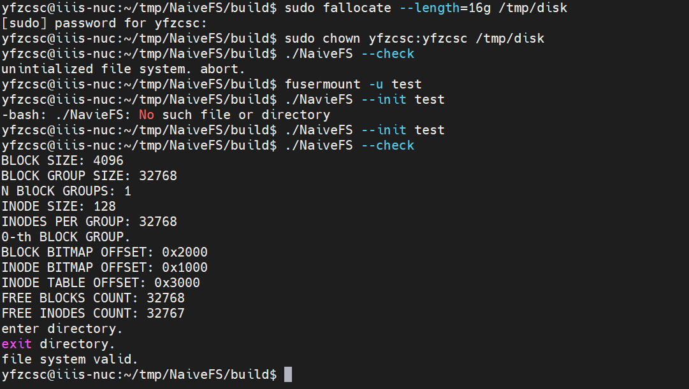
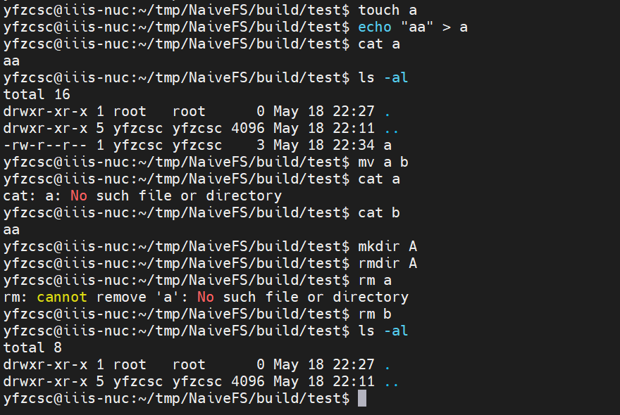
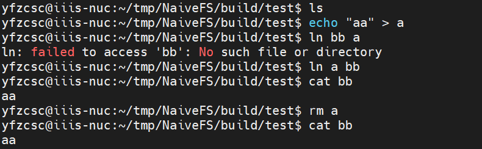
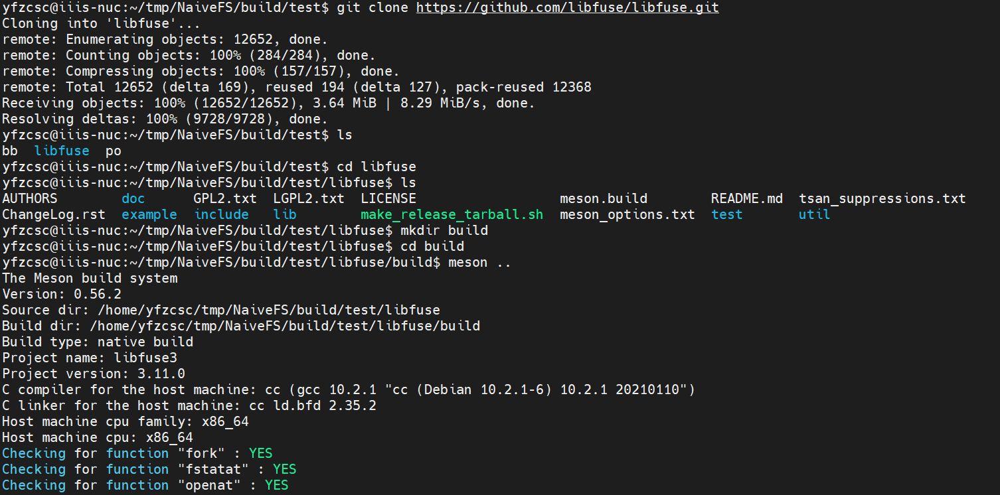
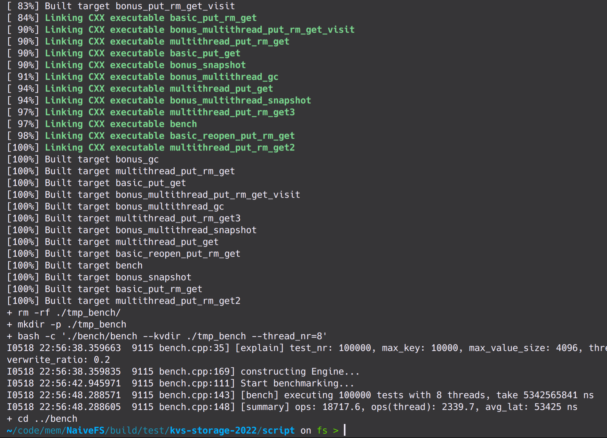
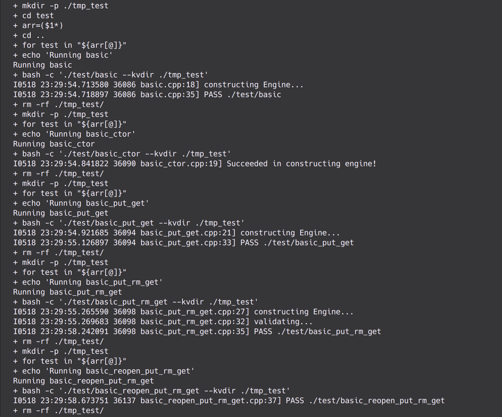
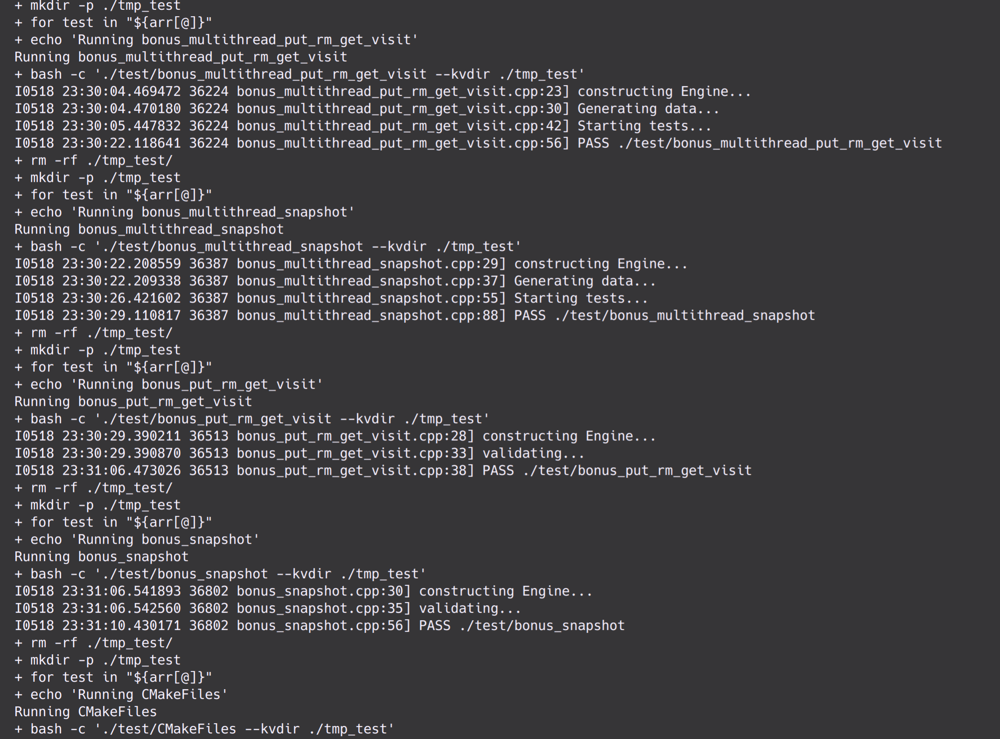
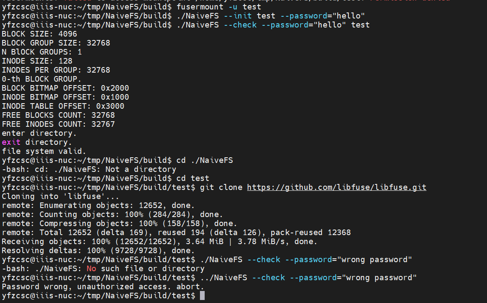
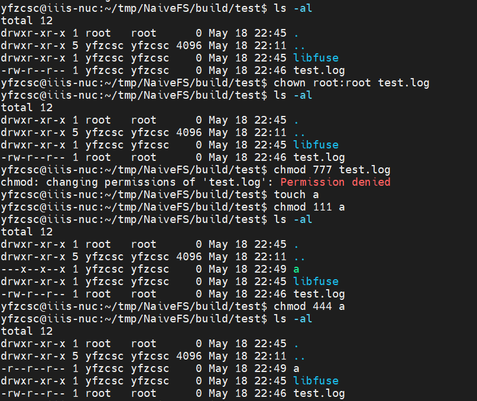
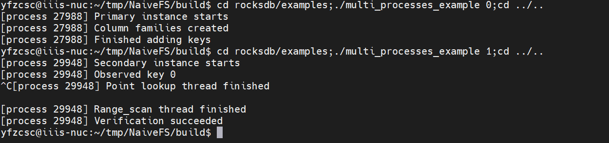

## NaiveFS

#### 一、项目概述

----------------

- **参考资料**：libfuse相关文档及代码注释，ext2/ext4文件系统规范，linux用户库实现。
- **支持功能**（运行截图参见附录）：
  - **Baseline**:实现了大部分fuse功能函数，并支持大部分命令操作例如ls、cat、touch、mkdir、ln、ln -s、mv、rmdir、rm、chmod、chown、cp、find等，且支持常用软件的运行，如vim、git、g++、cmake等。
  - **Functionality**:可在文件系统内从仓库拉取、编译并运行KV存储引擎（执行并通过所有test脚本）;可在文件系统内从仓库拉取、编译并运行rocksdb等大型开源项目。
  - **Consistency**：在成功fsync后保证状态是valid，如果在中途断电则不保证。但可以使用--check选项来检查文件系统状态。
  - **Durability**：fsync成功后或使用`fusermount`取消对文件夹的挂载后（DESTROY请求），数据和状态会被写入到虚拟磁盘。
  - **Security**:
    - **权限检查**：支持
    - **加密**：支持
  - **Performance**: TODO
- **目录结构**：

```txt
.
├── include
│   ├── AES.h
│   ├── block.h
│   ├── cache.h
│   ├── common.h
│   ├── crypto.h
│   ├── ext2
│   │   ├── basic.h
│   │   ├── dentry.h
│   │   ├── inode.h
│   │   └── super.h
│   ├── filesystem.h
│   ├── operation.h
│   └── utils
│       ├── bitmap.h
│       ├── disk.h
│       ├── logging.h
│       ├── option.h
│       └── path.h
├── LICENSE
├── README.md
├── report.md
├── run_release.sh
├── run.sh
└── src
    ├── block.cpp
    ├── cache.cpp
    ├── check_fs.cpp
    ├── crypto
    │   ├── aes256.cpp
    │   └── crypto.cpp
    ├── filesystem.cpp
    ├── main.cpp
    ├── operation
    │   ├── attr.cpp
    │   ├── data.cpp
    │   ├── dir.cpp
    │   ├── meta.cpp
    │   ├── operation.cpp
    │   ├── special.cpp
    │   └── symlink.cpp
    └── utils
        ├── bitmap.cpp
        ├── disk.cpp
        ├── logging.cpp
        └── path.cpp

7 directories, 39 files


```
- **代码统计**：

```txt
-------------------------------------------------------------------------------
Language                     files          blank        comment           code
-------------------------------------------------------------------------------
C++                             18            423            245           2727
C/C++ Header                    16            332            717           1322
-------------------------------------------------------------------------------
SUM:                            34            755            962           4049
-------------------------------------------------------------------------------
```

#### 二、代码架构

----------------
文件系统的设计可大致分为三层，每一层对上可屏蔽下层的操作,并提供抽象接口

##### 1.Block

- 定义在`block.h`文件中，作为各种Block的基类
- Block默认大小为4096B，在创建时会分配内存空间，在删除时释放分配的内存空间
- 创建Block时可能有两种情况：1.Block可能是新创建的，虚拟磁盘中的这块区域还未被使用过；2.Block从虚拟磁盘中读取过去写入的数据。为了处理这两种情况，调用者需要提供额外的参数，这样做的好处是在第一次写Block时可以避免一次额外的读Block
- 提供flush操作，将Block中的数据写入到虚拟磁盘对应的偏移量处
- SuperBlock：
  - 参考ext2的规范定义了`super_block`结构和`group_desc`结构，用来对多个Block Group进行索引和管理，具体参见代码实现
  - 根据两种结构的大小我们可以计算出文件系统支持的最大Block Group数量:`super_block`大小为1024B，`group_desc`大小为32B，故可支持最多Block Group：`(4096-1024)/32=96`个
- BitmapBlock:
  - 封装了Bitmap类，主要用于管理Inode Bitmap和Block Bitmap
  - 提供`alloc_new()`接口，首先在Bitmap中寻找闲置位，返回index并将闲置位置为1，调用者会根据拿到的index自行计算偏移量
- InodeTableBlock：创建时会将Block的数据转化为inode数据指针保存在vector中，便于之后的访问
- DentryBlock：
  - 主要针对inode类别为文件夹的情况，创建时将有效的（`name_len`不为0）dentry指针存储在vector中
  - 提供`alloc_dentry()`接口，根据当前Block已被占据的数据计算出新建dentry需要插入的位置
  - 该设计目标是配合删除dentry时将`name_len`置为0的操作，可能在频繁的文件创建删除情况下产生大量空洞，解决该问题的一种办法是牺牲一部分性能进行压缩，另一种办法是定期进行垃圾回收，由于时间原因，以上设计思路仅作参考
- BlockGroup：主要提供以下接口对内部数据进行管理，代码中给出了BlockGroup的规模，可以计算出，每个BlockGroup最多支持32768个inode和32768个数据块，再结合上文中给出的最大BlockGroup数量，可以得到文件系统的最大数据大小为12G，后文会针对inode的三级索引重新计算文件大小

```c++
class BlockGroup {
 public:
  BlockGroup(ext2_group_desc* desc, bool alloc = false);
  ~BlockGroup();
  void flush();
  bool get_inode(uint32_t index, ext2_inode** inode);
  bool get_block(uint32_t index, Block** block);
  bool alloc_inode(ext2_inode** inode, uint32_t* index, mode_t mode);
  bool alloc_block(Block** block, uint32_t* index);
  bool free_inode(uint32_t index);
  bool free_block(uint32_t index);

 private:
  ext2_group_desc* desc_;
  BitmapBlock* block_bitmap_;
  BitmapBlock* inode_bitmap_;
  std::map<uint32_t, InodeTableBlock*> inode_table_;
};
``` 

##### 2.FileSystem

```c++
class FileSystem {
 public:
  FileSystem();
  ~FileSystem();
  void flush();
  RetCode inode_create(const Path& path, ext2_inode** inode,
                       uint32_t* inode_index_result, mode_t mode);
  RetCode dentry_create(Block* last_block, uint32_t last_block_index,
                        ext2_inode* parent, const char* name, size_t name_len,
                        uint32_t inode_index, mode_t mode);
  RetCode inode_lookup(const Path& path, ext2_inode** inode,
                       uint32_t* inode_index = nullptr,
                       DentryCache::Node** cache_ptr = nullptr);
  RetCode inode_lookup(ext2_inode* parent, const char* name, size_t name_len,
                       bool* name_exists = nullptr,
                       uint32_t* inode_index = nullptr,
                       Block** last_block = nullptr,
                       uint32_t* last_block_index = nullptr);
  RetCode inode_delete(uint32_t inode_index);
  RetCode inode_unlink(const Path& path);
  RetCode inode_link(const Path& src, const Path& dst);
  void visit_inode_blocks(ext2_inode* inode, const BlockVisitor& visitor);
  bool visit_indirect_blocks(Block* block, uint32_t num,
                             const BlockVisitor& visitor);
  bool get_inode(uint32_t index, ext2_inode** inode);
  bool get_block(uint32_t index, Block** block, bool dirty = false,
                off_t offset = 0, const char* buf = nullptr,
                size_t copy_size = 0);
  bool alloc_inode(ext2_inode** inode, uint32_t* index, mode_t mode);
  bool alloc_block(Block** block, uint32_t* index);
  bool alloc_block(Block** block, uint32_t* index, ext2_inode* inode);
  bool alloc_block_group(uint32_t* index);
  bool free_inode(uint32_t index);
  bool free_block(uint32_t index);
  inline void write_block(Block* block, uint32_t index, const char* buf,
                          size_t size);

 private:
  // Super block
  SuperBlock* super_block_;
  // Root inode
  ext2_inode* root_inode_;
  // Block Groups
  std::map<uint32_t, BlockGroup*> block_groups_;
  // block index mapped to block allocated in memory
  BlockCache* block_cache_;
  // name mapped to directory entry metadata
  DentryCache* dentry_cache_;
```

- `root_inode_`：在创建文件系统时会检查`SuperBlock`状态，如果未被初始化，就创建`root_inode_`作为根目录，该节点不可删除
- `inode_lookup`：根据提供的路径向下查找，首先检查`DentryCache`，若命中则继续向下查找直到找到路径的最后一项，若缺失则查询`DentryBlock`，并将查询结果插入`DentryCache`
- `inode_create`:主要分为以下步骤：
  - ，
  - 遍历父目录内并判断是否存在和待创建名称重复项，遍历的同时获取父目录inode的最后一个`DentryBlock`
  - 若`DentryBlock`已满，则为父目录inode分配新的`DentryBlock`
  - 分配新inode
  - 创建新的dentry，并将dentry插入到`DentryBlock`中
- `inode_delete`：分级遍历并释放inode的所有直接或间接索引Block
- `inode_link`：逻辑和`inode_create`类似，但不创建inode，而是创建新的dentry并指向已创建的inode，增加inode的link计数
- `inode_unlink`：删除dentry同时将减少对应的inode的link计数，若计数归零，调用`inode_delete`删除inode
- `visit_inode_blocks`：需要传入visitor，格式为`std::function<bool(uint32_t, Block*)>`，根据visitor的返回值终止遍历；遍历会访问inode的所有直接或间接索引的inode
- `get_inode/get_block`：根据传入的index，查询对应的Block Group，如果Block Group还未被读入到内存中，则优先加载`Block Group`并读取
- `alloc_block`：该部分逻辑较为复杂，在为inode创建Block的过程中，可能出现某一级索引溢出的情况，该溢出可能是创建新的该级索引，甚至是创建更高级的索引
- `free_inode/free_block`：调用对应flush或delete函数，释放bitmap中的空间
##### 3.FileStatus

```C++
class FileStatus {
 public:
  class IndirectBlockPtr {
   public:
    uint32_t id_;
    IndirectBlockPtr() { id_ = 0; }
    IndirectBlockPtr(uint32_t indirect_block_id) : id_(indirect_block_id) {}
    bool seek(off_t off, uint32_t &block_id) {
      Block *blk;
      if (!fs->get_block(id_, &blk)) return false;
      block_id = (reinterpret_cast<uint32_t *>(blk->get()))[off];
      return true;
    }
  };
  InodeCache *inode_cache_;
  FSListPtr<FileStatus*>* fslist_ptr_;
  bool cache_update_flag_;
  uint32_t block_id_;                 
  uint32_t block_id_in_file_;    
  IndirectBlockPtr indirect_block_[3];  
  std::shared_mutex rwlock;             
  FileStatus();
  ~FileStatus() = default;

  void rel();
  int next_block();
  int seek(uint32_t new_block_id_in_file);
  int bf_seek(uint32_t new_block_id_in_file);
  int _upd_cache();
  void init_seek();
  int copy_to_buf(char *buf, size_t offset, size_t size);
  int write(const char *buf, size_t offset, size_t size, bool append_flag = false);
  int append(const char *buf, size_t offset, size_t size);
};
```

- `inode_cache_`会在初始化的时候指向对应的`InodeCache`。
- `fslist_ptr_`是`InodeCache`中的`File Status*`的链表指针。
- `cache_update_flag_`表示是否需要更新本地`indirect_block_`缓存。
- 由于大部分文件访问都是连续的block访问或者是某个block内部的小范围访问，所以`block_id_`记一个当前block的index。对于大文件，不可能每次都去查indirect block，所以再用`indirect_block_`缓存各级的indirect block。
- `block_id_in_file_`是当前文件指针在文件的第几个block。
- `rwlock`用来支持并发访问。
- `next_block`用于快速通过现在的`block_id_`、`indirect_block_`、`block_id_in_file_`查询到下一个block。
- `seek`、`bf_seek`用于找某个块。其中`seek`使用缓存，`bf_seek`不使用任何缓存，直接读`InodeCache`。
- `_upd_cache`用于update本地的cache。
- `copy_to_buf`、`write`读写文件。总的来说，可以并发地读文件，但是每个`FileStatus`每次只能有一个线程进行`write`。如果有多个`FileStatus`进行`write`，那么每次只有一个能修改`InodeCache`。
- `append`如果使用了`O_APPEND`的flag，就会先重置`offset`再调用`write`。

#### 三、优化设计

##### 1.DentryCache

- 参考ext2中dcache的设计，采用多叉树结构，每一级采用环形链表，头部指向最新插入或访问到的dentry
- 由于dentry占据空间较小，除去删除dentry外，在文件系统运行过程中并未对空间进行释放

##### 2.BlockCache

- 占据主要的缓存空间，对数据块进行缓存和管理
- 通过`unordered_map`进行索引，采用LRU替换策略
- 一个Block的空间只有在从Cache中移除的时候才会被彻底释放，可以根据索引对Cache中的某一项进行flush
- 最终使用的总项数为32768，占据总空间约为128M

##### 3.InodeCache

- 对多个`FileStatus`共用的inode进行缓存，因为`FileStatus`需要读取指向block的指针。如果每次都用`get_inode`查会大大降低性能。
- 在必要的时候使用commit把缓存提交。
- 使用`OpManager`对`InodeCache`进行管理，记录引用计数，如果一个`InodeCache`没有被任何`FileStatus`引用，就将它销毁。
- 用读写锁（`std::shared_mutex`）管理并发访问，当`FileStatus`只读时用共享锁，否则用互斥锁。在读文件时是共享锁，可以支持并发地读取。在写文件时如果要append新的block，则要将共享锁换成互斥锁，否则只需要共享锁。大体上支持并发的读写。
- 当一个`InodeCache`被更新时，它会通知所有引用它的`FileStatus`。这是用一个记录`FileStatus*`的链表实现的。

#### 四、其他实现

##### 1. Auth

- 使用AES256CBC对Inode bitmap、Block bitmap、Inode table、Block进行加密，在Super block里记一个长为64的字符串，初始化时如果这个字符串解析正确，则说明密码正确，否则返回解密失败。
- 只在从磁盘中读、向磁盘写的时候加密，其他时候不加密。

##### 2. Check FileSystem

- 按照文件系统初始化的顺序读取block，检查中间的数值是否符合范围。
- 遍历整个文件系统，检查是否出现矛盾。


#### 五、总结

- 根据老师课上讲的文件系统进行架构和设计，思路看起来比较直接和简单，但实际实现的过程中遇到了很多边界条件，这些问题有一部分没能在编写代码的时候就考虑周全，在后续运行更大程序时才突然出现bug，给调试带来了很大挑战
- 由于fuse功能函数是与内核有关的回调函数，无法输出到终端进行调试，也无法用gdb；从网上找的Logger极大地方便了调试，可以迅速定位问题出现的位置和信息，建议布置作业时直接提供调试环境
- 分工：
  - 田凯夫：Block、FileSystem、Cache、fuse_link、fuse_unlink、fuse_init、fuse_destroy、fuse_symlink、fuse_readlink
  - 袁方舟：FileStatus、OpManager、InodeCache、Auth、fuse_attr、fuse_chmod、fuse_read、fuse_write、fuse_mkdir、fuse_rmdir、fuse_readdir、fuse_create、fuse_open、fuse_rename、fuse_utimens、fuse_release、fuse_fsync、fuse_chown、fuse_flush、check_filesystem

#### 六、附录（运行截图）

使用方法：首先必须准备一个比较大的文件，放在/tmp/disk。
- `--init` 表示重置文件系统
- `--check` 表示检查文件系统，不能和`--init`共用。
- `--password=<s>` 表示输入密码，可以没有这个选项，密码默认为空。

挂载：



基础操作：



软硬链接：



使用Github:




KV:




加密：



权限管理：




RocksDB测试，使用examples/multi_processes_example，改了一点参数。



